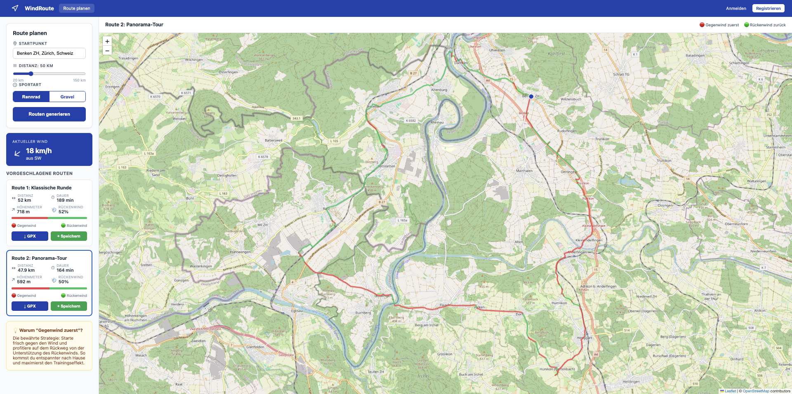
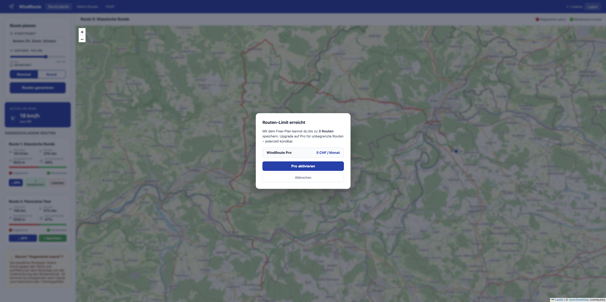
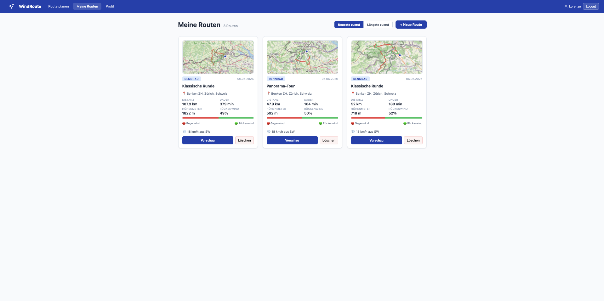
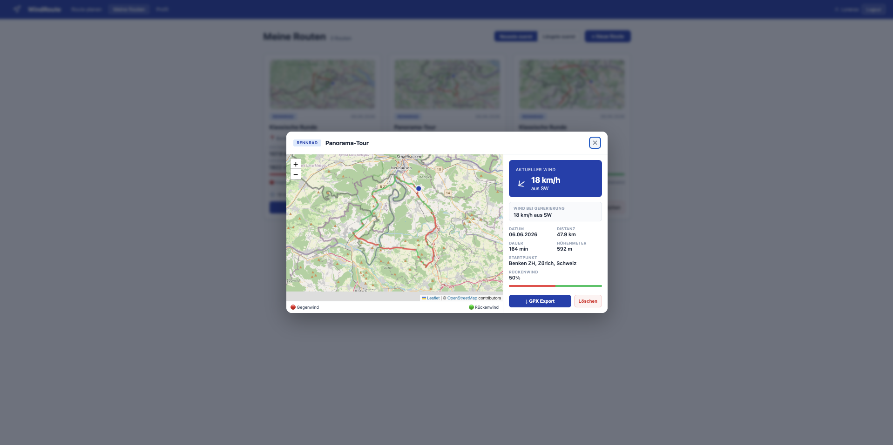
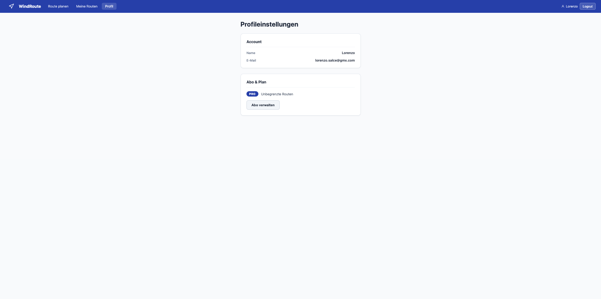
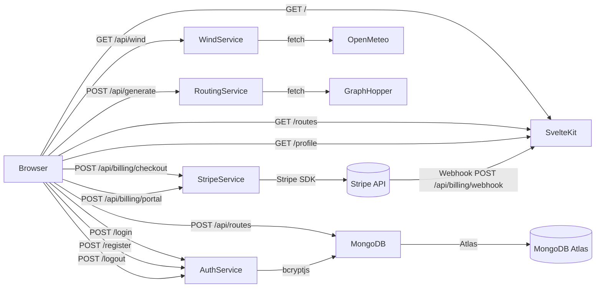

# Projektdokumentation - WindRoute: Windoptimierte Trainingsrouten für Ausdauersportler

## Inhaltsverzeichnis

1. [Ausgangslage](#1-ausgangslage)
2. [Lösungsidee](#2-lösungsidee)
3. [Vorgehen & Artefakte](#3-vorgehen--artefakte)
    1. [Understand & Define](#31-understand--define)
    2. [Sketch](#32-sketch)
    3. [Decide](#33-decide)
    4. [Prototype](#34-prototype)
    5. [Validate](#35-validate)
4. [Erweiterungen [Optional]](#4-erweiterungen-optional)
5. [Projektorganisation [Optional]](#5-projektorganisation-optional)
6. [KI-Deklaration](#6-ki-deklaration)
7. [Anhang [Optional]](#7-anhang-optional)

> **Hinweis:** Massgeblich sind die im **Unterricht** und auf **Moodle** kommunizierten Anforderungen.

<!-- WICHTIG: DIE KAPITELSTRUKTUR DARF NICHT VERÄNDERT WERDEN! -->

## 1. Ausgangslage

- **Problem:** Ausdauersportler:innen (Rennrad/Gravel) müssen vor jedem Training eine Route wählen. Dabei treten im Alltag drei Reibungspunkte auf:
  1. **Entscheidungsmüdigkeit** — bei jeder Ausfahrt muss neu entschieden werden, wohin es geht.
  2. **Zu viele Optionen** — Apps wie Komoot, Strava oder Ride with GPS bieten unzählige Routenvorschläge, aber keine kontextsensitive Auswahl für den heutigen Tag.
  3. **Wind als übersehener Faktor** — der Wind ist neben Steigungen der grösste Einflussfaktor auf Anstrengung und Trainingserlebnis, wird aber in den meisten Routenplaner-Apps bei der Empfehlung nicht automatisch berücksichtigt.
  
  Die in der Cycling-Community weit verbreitete Faustregel lautet: *"Starte gegen den Wind, komm mit dem Wind nach Hause"*. Aktuell muss diese Planung manuell erfolgen (Wetter-App öffnen, Windrichtung prüfen, Route selbst entsprechend legen).

- **Ziele:**
  - Automatische Generierung von 1–2 passenden Trainingsrouten pro Tag basierend auf aktueller Windvorhersage
  - "Gegenwind zuerst, Rückenwind zurück"-Logik als Kernprinzip
  - Reduktion kognitiver Belastung: ein Klick statt manueller Planung
  - Unterstützung für Rennrad- und Gravel-Fahrer:innen

- **Primäre Zielgruppe:** Hobby- und ambitionierte Hobby-Ausdauersportler:innen (Rennrad/Gravel), die regelmässig (1–5× pro Woche) trainieren und schnell eine sinnvolle Trainingsroute ab einem festen Startpunkt (meist zu Hause) brauchen.

- **Weitere Stakeholder [Optional]:** Trainer:innen, die Trainingspläne gestalten; Radsportvereine; perspektivisch auch Läufer:innen als zweite Zielgruppe.

## 2. Lösungsidee

Eine Web-App (**WindRoute**), die dem/der Sportler:in zu Beginn eines Trainingstages automatisch 1–2 Streckenvorschläge ab einem gewählten Startpunkt macht — wobei der erste Teil der Route gegen den Wind und der zweite Teil mit dem Wind verläuft.

- **Kernfunktionalität:**
  1. Nutzer:in gibt Startpunkt, gewünschte Distanz (z.B. 40 km) und Sportart (Rennrad/Gravel) ein
  2. App ruft die aktuelle Windrichtung & -stärke für den Standort ab (Open-Meteo API)
  3. App generiert via Routing-API (GraphHopper `round_trip` mit `heading`-Parameter) 1–2 Rundkurse, die in Windrichtung starten
  4. Routen werden auf einer Karte angezeigt inkl. Farbcodierung (Gegenwind rot, Rückenwind grün) und Export als GPX für den Radcomputer

- **Annahmen [Optional]:**
  - Nutzer:innen finden die Routenvorschläge nützlicher als eine manuelle Suche
  - Die GraphHopper `round_trip`-Funktion liefert Routen in fahrbarer Qualität
  - Der "Gegenwind-zuerst"-Ansatz wird als positiv empfunden (nicht alle Nutzer:innen bevorzugen das)
  - Eine Web-App reicht als erste Lösung; eine native Mobile-App ist nicht zwingend nötig

- **Abgrenzung [Optional]:**
  - **Nicht** im Umfang: Trainingsplanung (Intervalle, Wattvorgaben), Social Features, Navigation während der Fahrt, Tracking/Aufzeichnung der Fahrt, Mehrtages-Touren
  - **Nicht** im Umfang: Berücksichtigung von Steigungen, Strassenbelag-Qualität oder Verkehr (bleiben für eine spätere Iteration)

## 3. Vorgehen & Artefakte

### 3.1 Understand & Define

#### Zielgruppenverständnis

**Problemraumanalyse**

| Nutzer | Bedürfnisse | Kontext / Herausforderungen | HMW |
|---|---|---|---|
| Ausdauersportler:innen (Rennrad/Gravel), die eine Trainingsstrecke brauchen | 1–2 Vorschläge an Trainingsrouten für den heutigen Tag, bei denen zuerst gegen den Wind und danach mit dem Wind gefahren wird | - nicht jedes Mal selbst entscheiden müssen<br>- zu viele verschiedene Möglichkeiten<br>- Training muss oft einfach und schnell planbar sein<br>- Wind wird in Planer-Apps heute kaum automatisch berücksichtigt | - Wie können wir Sportler:innen helfen, damit sie nicht jedes Mal selbst entscheiden müssen, wohin sie fahren?<br>- Wie können wir für spezifische Trainingseinheiten geeignete Routen vorschlagen?<br>- Wie können wir Routen so planen, dass sie je nach Wetter optimal genutzt werden können? |

**Proto-Persona (Entwurf):** Jonas, 32, arbeitet im Büro, besitzt ein Rennrad und Gravelbike, fährt 3× pro Woche ab zu Hause los (meist 1–2 h). Will schnell losfahren und nicht 15 Minuten mit Routenplanung verbringen.

#### Wesentliche Erkenntnisse aus der Recherche

**a) Die "Gegenwind-zuerst"-Strategie ist in der Cycling-Community fest etabliert:**
- Mehrere unabhängige Fachquellen (BikeRadar, Roadman Cycling, RoadBikeRider, TrainRight, Cyclist) bestätigen: Starte bei einer Out-and-Back-Route frisch in den Wind und komm mit Rückenwind zurück. Das ist physisch und psychologisch vorteilhaft.
- Beleg: Roadman Cycling formuliert diese Regel als expliziten Strategietipp für Rennradfahrer.
- Quelle: https://roadmancycling.com/blog/cycling-headwind-strategies

**b) Bestehende Apps analysieren Wind, schlagen aber keine Routen vor:**

| App | Funktion | Lücke |
|---|---|---|
| **myWindsock** (Web, £19.99/Jahr) | Zeigt Gegen-/Rückenwind-Anteile auf einer vom User geplanten Route | Keine Routengenerierung; kostenpflichtig |
| **Headwind App** (kostenlos, via Strava) | Farbliche Visualisierung von Wind entlang bestehender Routen | Nur Analyse existierender Routen |
| **Epic Ride Weather** (Abo) | Hyperlokale Vorhersage alle 10 Minuten entlang der Route | Route muss bereits existieren |
| **Bikemap** | Wind-Overlay auf Karten, 10-Tage-Wind-Vorhersage | Automatische Rundtouren, aber nicht windoptimiert |
| **Komoot / Strava / Ride with GPS** | Standard-Routenplanung | Keine Windlogik in der Empfehlung |

➡ **Marktlücke:** Alle gefundenen Tools arbeiten **reaktiv** (User plant Route → App zeigt Wind). Kein Tool arbeitet **proaktiv** im Sinne von "heute ist Wind aus West, also bekommst du diese Rundroute". Das ist der Differenzierungspunkt für WindRoute.

**c) Es gibt direkte Nutzeräusserungen, die diesen Bedarf bestätigen:**
- In der Diskussion zur Headwind App wurde genau diese Idee explizit als Wunsch geäussert: ein Feature, das automatisch bewertet/auswählt, welche Route bei den heutigen Windbedingungen am sinnvollsten wäre.
- Quelle: https://road.cc/content/tech-news/free-headwind-app-provides-visualisation-wind-conditions-273403

**d) Technische Machbarkeit ist für einen Prototyp gegeben:**

| Zweck | API / Tool | Besonderheit |
|---|---|---|
| **Wind- & Wetterdaten** | [Open-Meteo](https://open-meteo.com/) | Kostenlos, kein API-Key, kein Registrierung, liefert stündliche Windrichtung & -geschwindigkeit (`wind_direction_10m`, `wind_speed_10m`) |
| **Routing (Rundfahrten)** | [GraphHopper Directions API](https://docs.graphhopper.com/openapi/routing) | Bietet `algorithm=round_trip` mit `heading`-Parameter (0–360°) — d.h. man kann die Startrichtung (= Windrichtung) direkt vorgeben. Genau passend für unsere Logik. |
| **Alternative Routing-APIs** | OpenRouteService, OSRM, Valhalla | Alle kostenlos, profilspezifisch (Rennrad, Gravel/MTB) |
| **Karten-Rendering** | Leaflet / MapLibre | Open Source, gut in SvelteKit integrierbar |

**Kern-Insight für die Umsetzung:** Die Kombination `Open-Meteo (Windrichtung)` + `GraphHopper round_trip (heading = Windrichtung)` erlaubt die Kernfunktion mit minimalem Aufwand. Das ist die technische Grundhypothese, die im Prototyp validiert wird.

### 3.2 Sketch

Als zentrales Feature für die Crazy-8s-Übung wurde das **Hauptinterface der Routengenerierung** gewählt — das Element, das Eingabeformular (Startpunkt, Distanz, Sportart) und Kartenanzeige verbindet und damit den Kern der App ausmacht.

**Crazy 8s**  
In 8 Minuten entstanden 8 Varianten desselben Features: Vollbildkarte mit schwebendem Eingabe-Panel, Zwei-Spalten-Layout (Formular links, Karte rechts), Schritt-für-Schritt-Wizard, seitliche Sidebar, schmale untere Leiste mit kompaktem Formular, Karte mit übergelagertem Suchfeld (à la Google Maps), Popup-Dialog zur Routeneingabe sowie eine vertikale Kachel-Ansicht. Ziel war Quantität, nicht Ausarbeitung.

**Peer Dot-Voting & Feedback**  
In der anschliessenden Kleingruppen-Runde verteilten die anderen Teilnehmenden je 3 Punkte auf die Ideen. Die meisten Punkte erhielten das Zwei-Spalten-Layout und die Sidebar-Variante. Qualitatives Feedback:
- *"Das Zwei-Spalten-Layout macht sofort klar, was die App tut — links eingeben, rechts sehen."*
- *"Der Wizard wirkt unnötig komplex für eine tägliche Nutzung."*
- *"Die Vollbildkarte ist ansprechend, aber das Panel verdeckt immer genau den Bereich, den man sehen will."*

**Reflexion Entscheidungsprozess**  
Gewählt wurde das **Zwei-Spalten-Layout**. Das Peer-Feedback hat diese Wahl bestätigt und geschärft — insbesondere der Hinweis auf die tägliche Nutzung hat verdeutlicht, dass ein Wizard für erfahrene Nutzer:innen bremsend wirkt. Die Vollbildkarte wurde trotz ästhetischem Vorteil verworfen, weil das schwebende Panel auf kleinen Bildschirmen kritische Kartenbereiche verdeckt.

Die vollständigen Artefakte (Foto der Crazy-8s inkl. Dots und Kommentare, Peer-Feedback-Notizen, ausgearbeitete Skizze) sind in den beigefügten JPGs dokumentiert: Skizze_Prototyping_Lorenzo_Salce_Seite_1 und Skizze_Prototyping_Lorenzo_Salce_Seite_2 (./docs)

### 3.3 Decide

#### Gewählte Variante & Begründung

Umgesetzt wurde **Variante B** (Zwei-Spalten-Layout). Die Entscheidung basierte auf drei Kriterien:

- **Nutzerzentrierung:** Formular und Karte sind gleichzeitig sichtbar — der/die Nutzer:in sieht die Route sofort nach der Generierung, ohne zwischen Schritten zu navigieren oder ein Panel zu verschieben. Damit entspricht das Layout dem mentalen Modell: "Ich gebe meinen Startpunkt ein und sehe direkt, wohin die Route führt."
- **Umsetzbarkeit:** Ein Zwei-Spalten-Grid ist in SvelteKit/CSS ohne komplexe State-Verwaltung realisierbar. Overlay-Panels (Variante A) erfordern dagegen Positionierungslogik und z-index-Verwaltung, die bei verschiedenen Viewport-Grössen fehleranfällig ist.
- **Technische Machbarkeit:** Leaflet benötigt ein DOM-Element mit definierten Dimensionen zur Initialisierung. Eine feste rechte Spalte erfüllt diese Bedingung zuverlässig, ein `display: none`-Panel hingegen nicht — was bei Variante A zu Initialisierungsfehlern geführt hätte.

Variante C wurde verworfen, weil der "Gegenwind-zuerst"-Ansatz nach einmaliger Erklärung intuitiv ist und kein mehrschrittiges Onboarding rechtfertigt. Die Zielgruppe (regelmässig trainierende Radsportler:innen) führt diesen Ablauf täglich durch — ein Wizard würde sie ausbremsen.

Referenz-Mockup: [Figma-Prototyp](https://www.figma.com/proto/pPo0i8wmxxtPgsF0BRzoaB/WindRoute?node-id=1-4&p=f&t=ldi0zPSmsmIe2h9w-0&scaling=contain&content-scaling=responsive&pageid=0%3A1&starting-point-node-id=1%3A4)

#### End-to-End-Ablauf

Der vollständige Ablauf — vom Login bis zum GPX-Export — läuft wie folgt ab:

1. Nutzer:in registriert sich oder meldet sich an; ein HTTP-only Session-Cookie (30 Tage gültig) wird gesetzt.
2. Auf der Hauptseite gibt die Nutzer:in Startpunkt, gewünschte Distanz und Sportart ein. Der Startpunkt wird per Photon-Geocoding in `lat/lng` aufgelöst.
3. Klick auf "Routen generieren": `/api/wind` ruft die aktuelle Windrichtung und -stärke von Open-Meteo ab.
4. `/api/generate` übergibt Windrichtung als `heading`-Parameter an die GraphHopper `round_trip`-API. Ein iterativer Algorithmus (max. 3 Versuche) korrigiert die Ausgabe-Distanz auf ±5 km Genauigkeit.
5. Für jedes Routensegment wird die Fahrrichtung mit der Windrichtung verglichen; das Ergebnis ist der Rückenwind-Prozentsatz. Die Karte zeigt die Segmente farbcodiert (rot = Gegenwind, grün = Rückenwind).
6. Die Nutzer:in wählt eine der beiden angezeigten Routen und speichert sie. Die Route wird mit der `userId` in MongoDB gespeichert und erscheint in "Meine Routen" mit Mini-Map-Vorschau.
7. Free-User können maximal 3 Routen speichern; beim vierten Speicherversuch antwortet die API mit HTTP 402 und das Frontend zeigt ein Upgrade-Modal.
8. Optional: Klick auf "Vorschau" in der Routen-Bibliothek öffnet ein Modal mit interaktiver Karte, aktuellem Wind (lazy-geladen) und einem Vergleich mit dem Wind zum Zeitpunkt der Generierung.
9. GPX-Export ist direkt aus dem Vorschau-Modal heraus möglich.

### 3.4 Prototype

#### 3.4.1. Entwurf (Design)

Der Figma-Prototyp zeigt den vollständigen Happy Path der App: von der Registrierung über die Routengenerierung bis zur Routen-Bibliothek und dem Vorschau-Modal. Das Hauptinterface setzt die in 3.3 gewählte Variante (Zwei-Spalten-Layout) um — links Eingabeformular und Routenliste, rechts die interaktive Karte mit Farbcodierung. Die Navigation beschränkt sich auf drei Bereiche: Hauptseite (Generierung), Meine Routen (Bibliothek) und Profil (Plan & Abo-Verwaltung).

[Figma-Prototyp (WindRoute)](https://www.figma.com/proto/pPo0i8wmxxtPgsF0BRzoaB/WindRoute?node-id=1-4&p=f&t=ldi0zPSmsmIe2h9w-0&scaling=contain&content-scaling=responsive&pageid=0%3A1&starting-point-node-id=1%3A4)

**Screenshots der fertigen App**


*Hauptseite: Zwei-Spalten-Layout mit Eingabeformular (links) und farbcodierter Route auf der Karte (rot = Gegenwind, grün = Rückenwind).*


*Upgrade-Modal: erscheint beim vierten Speicherversuch eines Free-Users (HTTP 402).*


*Routen-Bibliothek: gespeicherte Routen mit Mini-Map-Vorschau, Distanz, Rückenwind-Prozent und Aktionsbuttons.*


*Vorschau-Modal: interaktive Karte, aktueller Wind am Startpunkt (lazy-geladen), Windvergleich mit Zeitpunkt der Generierung sowie GPX-Export.*


*Profilseite: Plan-Anzeige (Free/Pro), Upgrade-Button und Abo-Verwaltung via Stripe Customer Portal.*

#### 3.4.2. Umsetzung (Technik)

**Deployment:** [https://windroute.netlify.app](https://windroute.netlify.app)

**Tech-Stack**

| Schicht | Technologie | Begründung |
|---|---|---|
| Framework | SvelteKit 2 (Svelte 5 Runes) | SSR + Client-Routing in einem; Svelte 5 Runes für reaktiven State |
| Sprache | JavaScript mit JSDoc-Types | Typeprüfung ohne TS-Compiler-Overhead |
| Datenbank | MongoDB Atlas (Free Tier) | Flexibles Schema für GeoJSON-Geometrien; Atlas ohne eigenen Server |
| Authentifizierung | Eigenbau (bcryptjs + `node:crypto`) | Session-basiert mit HTTP-only Cookie; kein externer Auth-Provider |
| Karte | Leaflet 1.9 | Open-Source, leichtgewichtig, gut integrierbar |
| Deployment | Netlify (adapter-netlify) | Serverless Functions für SvelteKit-Server-Routes |
| Wind-API | Open-Meteo | Kostenlos, kein API-Key, stündliche Winddaten |
| Routing-API | GraphHopper Directions API | `round_trip` + `heading`-Parameter = Kerntechnik der App |
| Geocoding | Photon (Komoot) | Open-Source, kein API-Key, deutschsprachige Ergebnisse |
| Zahlungen | Stripe (Node.js SDK) | Subscription-Billing für den Pro-Plan; Webhook-basierte Plan-Verwaltung |

**Architektur**



**Datenmodell**

```
users    {
           _id, email, passwordHash, displayName?, createdAt,
           plan: 'free' | 'pro',          ← Standard: 'free'
           stripeCustomerId?,             ← gesetzt nach erstem Checkout
           stripeSubscriptionId?,
           subscriptionStatus?,           ← 'active' | 'canceled' | 'past_due'
           subscriptionCurrentPeriodEnd?  ← nächste Verlängerung / Ende bei Kündigung
         }
sessions { _id (Token), userId, expiresAt }
routes   { …, userId, wind, geometry, tailwindPercent, … }
processedWebhookEvents { stripeEventId, processedAt }  ← Idempotenz-Guard
```

Der Session-Token ist 32 zufällige Bytes (`node:crypto.randomBytes`), base64url-kodiert, und wird als HTTP-only / SameSite=Lax Cookie gesetzt. Bei jedem Request prüft `src/hooks.server.js` den Cookie und legt das User-Objekt in `event.locals.user` ab.

Die Collection `processedWebhookEvents` verhindert, dass ein Stripe-Webhook-Event bei Mehrfachlieferung doppelt verarbeitet wird (Idempotenz).

**Hauptworkflow**

1. Nutzer:in registriert sich oder meldet sich an → Session-Cookie wird gesetzt (30 Tage gültig)
2. Nutzer:in gibt Startpunkt ein → Photon-Geocoding liefert `lat/lng`
3. Klick auf "Routen generieren" → `/api/wind` holt aktuellen Wind (Open-Meteo)
4. `/api/generate` ruft GraphHopper mit `algorithm=round_trip`, `heading=windDirectionDeg` und `seed=0/1` auf. Die tatsächliche Route weicht oft von der gewünschten Distanz ab (Strassen sind länger als Luftlinie). Deshalb skaliert ein iterativer Algorithmus (max. 3 Versuche) die Wegpunkt-Abstände, bis das Ergebnis innerhalb von ±5 km liegt.
5. Für jedes Segment der Route wird Fahrrichtung vs. Windrichtung verglichen → Rückenwind-Prozent
6. Nutzer:in kann generierte Routen per Speichern-Button sichern (erfordert Login) → erscheinen in "Meine Routen" (`/routes`) mit Mini-Map-Vorschau und Sortierung; jede Route ist mit der `userId` verknüpft
7. Leaflet-Karte zeigt Route segmentiert: rot (Gegenwind) / grün (Rückenwind)
8. **Plan-Enforcement:** Free-User können maximal 3 Routen speichern. Beim Versuch, eine 4. Route zu speichern, antwortet `POST /api/routes` mit HTTP 402, das Frontend zeigt ein Upgrade-Modal.
9. **Stripe-Checkout:** Klick auf "Pro aktivieren" erstellt serverseitig eine Stripe Checkout Session (Modus `subscription`, 5 CHF/Monat) und leitet zur Stripe-Seite weiter. Nach erfolgreicher Zahlung wird der Plan sowohl per Webhook als auch direkt über die Session-ID auf der Erfolgsseite auf `pro` gesetzt.
10. **Vorschau-Modal:** In "Meine Routen" öffnet ein Klick auf "Vorschau" ein Modal mit der interaktiven Karte, aktuellem Wind (lazy-geladen), einem Vergleich mit dem gespeicherten Wind bei Routengenerierung sowie GPX-Export und Löschen.

**Projektstruktur**

```
src/
├── hooks.server.js          # Session-Cookie bei jedem Request prüfen → locals.user
├── app.d.ts                 # App.Locals-Typdefinition (user)
├── lib/
│   ├── components/
│   │   ├── NavBar.svelte          # Navigation mit Plan-Link (Profil)
│   │   ├── MapView.svelte         # Interaktive Leaflet-Karte (Hauptseite)
│   │   ├── MiniMap.svelte         # Statische Vorschau-Karte in der Bibliothek
│   │   ├── RoutePreviewModal.svelte  # Modal mit Karte + aktuellem Wind + Metadaten
│   │   ├── WindIndicator.svelte   # Wind-Anzeige (Pfeil + km/h + Himmelsrichtung)
│   │   └── LoadingSpinner.svelte
│   ├── models/
│   │   └── route.js               # JSDoc-Typdefinitionen (Route, WindSnapshot)
│   └── server/
│       ├── db/client.js           # MongoDB-Singleton (serverless-kompatibel)
│       ├── auth/
│       │   ├── password.js        # hashPassword / verifyPassword (bcryptjs, 12 Runden)
│       │   └── session.js         # createSession / validateSession / deleteSession
│       ├── billing/
│       │   └── stripe.js          # Stripe-Client-Singleton (analog zu db/client.js)
│       └── services/
│           ├── wind.js            # Open-Meteo-Integration
│           └── routing.js         # GraphHopper + iterative Distanzkorrektur
└── routes/
    ├── +layout.svelte             # Globales Layout (NavBar)
    ├── +layout.server.js          # Gibt locals.user an alle Pages weiter
    ├── +page.svelte               # Hauptseite: Formular + Karte + Upgrade-Modal (402)
    ├── login/                     # Login (Form-Action)
    ├── register/                  # Registrierung (Form-Action)
    ├── logout/                    # POST: Session löschen, Redirect /
    ├── profile/
    │   ├── +page.server.js        # Plan-Daten + Session-Sync bei ?session_id=
    │   └── +page.svelte           # Profilseite: Plan-Anzeige, Upgrade, Abo-Verwaltung
    ├── routes/
    │   ├── +page.server.js        # Auth-Guard + eigene Routen laden
    │   └── +page.svelte           # "Meine Routen"-Bibliothek (Mini-Maps, Vorschau-Modal)
    └── api/
        ├── wind/                  # GET ?lat=&lng= → Wind-Snapshot
        ├── generate/              # POST → zwei Routen via GraphHopper
        ├── routes/
        │   ├── +server.js         # GET / POST — Plan-Check (Free max. 3), Auth-Guard
        │   └── [id]/+server.js    # DELETE (Auth-Guard + Owner-Check)
        └── billing/
            ├── checkout/+server.js  # POST → Stripe Checkout Session erstellen
            ├── portal/+server.js    # POST → Stripe Customer Portal Session
            └── webhook/+server.js   # POST → Stripe-Events verarbeiten (signaturgeprüft)
```

**Setup lokal**

```bash
git clone https://github.com/lorenzosalce/WindRoute.git
cd WindRoute
npm install
cp .env.example .env
# .env befüllen (alle Felder, siehe .env.example)
npm run dev
```

Beim ersten Start die App unter `http://localhost:5173/register` öffnen, ein Konto anlegen und anschliessend Routen generieren und speichern.

Für **Stripe-Webhooks** lokal ein zweites Terminal öffnen:

```bash
stripe listen --forward-to localhost:5173/api/billing/webhook
# Das ausgegebene whsec_...-Secret als STRIPE_WEBHOOK_SECRET in .env eintragen
```

Testkarte für den Stripe Checkout: `4242 4242 4242 4242`, Datum beliebig in der Zukunft, CVC beliebig.

**MongoDB-Indizes (einmalig in Mongo Shell / Compass anlegen)**

```js
// Abgelaufene Sessions automatisch löschen (TTL-Index)
db.sessions.createIndex({ expiresAt: 1 }, { expireAfterSeconds: 0 })
// E-Mail-Eindeutigkeit sicherstellen
db.users.createIndex({ email: 1 }, { unique: true })
// Webhook-Events eindeutig halten (Idempotenz)
db.processedWebhookEvents.createIndex({ stripeEventId: 1 }, { unique: true })
```

**Externe APIs & Limits**

| API | Limit (Free/Test) | Key nötig? |
|---|---|---|
| Open-Meteo | 10 000 Req/Tag | Nein |
| GraphHopper | 500 Req/Tag | Ja (graphhopper.com) |
| Photon (Komoot) | Keine offizielle Limite | Nein |
| MongoDB Atlas M0 | 512 MB Speicher | Nein (Connection String) |
| Stripe | Unbegrenzt im Test-Modus | Ja (stripe.com) |

### 3.5 Validate

#### Usability Evaluation

**URL der getesteten Version:**  
https://windroute.netlify.app *(Stand: 20.05.2026)*

---

**Ziele der Evaluation**

- Können Nutzer:innen intuitiv eine Route generieren, ohne die App zu kennen?
- Ist die "Gegenwind-zuerst"-Logik und die rot/grün-Farbcodierung auf der Karte verständlich?
- Können Nutzer:innen eine Route speichern (inkl. Registrierung)?
- Finden Nutzer:innen die gespeicherten Routen und die Vorschau-Funktion?
- Ist der GPX-Export auffindbar und verständlich?
- Ist der Upgrade-Flow (Free-Limit → Stripe-Checkout → Pro) verständlich und ohne Hürden durchführbar?
- Finden Nutzer:innen die Abo-Verwaltung (Stripe Customer Portal)?

---

**Vorgehen**

- Moderiert, on-site (Think-Aloud-Methode)
- Testleiter:in: Lorenzo Salce
- Testleiter:in interagiert minimal, stellt Fragen bei Unklarheiten
- Stripe-Aufgaben wurden im Testmodus durchgeführt (Testkarte `4242 4242 4242 4242`)
- Protokollierung mit Feedback Grid (eine Seite pro Testperson)

---

**Stichprobe**

| # | Name | Profil | Datum |
|---|------|--------|-------|
| TP-01 | Levin Kuhn | Mitstudierende:r | 20.05.2026 |
| TP-02 | Pascal Schuler | Mitstudierende:r | 20.05.2026 |

---

**Aufgaben / Szenarien**

1. **Route generieren:** Sie sind Rennradfahrerin und wollen eine Trainingsrunde von ca. 60 km ab Winterthur drehen. Lassen Sie sich auf WindRoute eine passende Route vorschlagen.
2. **Routen vergleichen:** Die App zeigt zwei Routenvorschläge. Vergleichen Sie diese und entscheiden Sie, welche Sie bevorzugen würden.
3. **Route speichern:** Speichern Sie die bevorzugte Route für später. (Falls nötig: Erstellen Sie zuerst ein Konto.)
4. **Gespeicherte Routen abrufen:** Rufen Sie Ihre gespeicherten Routen auf und öffnen Sie die Detailansicht einer Route.
5. **GPX-Export:** Exportieren Sie eine Route für den Radcomputer.
6. **Upgrade auf Pro:** Sie haben das Speicher-Limit des kostenlosen Kontos erreicht und möchten weiterhin Routen speichern. Führen Sie den Upgrade-Prozess durch (Testmodus).
7. **Abo verwalten:** Prüfen Sie, welche Zahlungsinformationen hinterlegt sind und wann das Abo erneuert wird.

---

**Kennzahlen & Beobachtungen**

| Aufgabe | TP-01 (Levin) | TP-02 (Pascal) | Beobachtungen |
|---------|--------------|----------------|---------------|
| 1. Route generieren | ✅ Ja | ✅ Ja | Beide ohne Probleme |
| 2. Routen vergleichen | ✅ Ja | ✅ Ja | Beide ohne Probleme |
| 3. Route speichern | ✅ Ja | ✅ Ja | Beide ohne Probleme |
| 4. Gespeicherte Routen | ✅ Ja | ✅ Ja | Beide ohne Probleme |
| 5. GPX-Export | ✅ Ja | ✅ Ja | Beide ohne Probleme |
| 6. Upgrade auf Pro | ✅ Ja | ✅ Ja | Upgrade-Flow für beide verständlich |
| 7. Abo verwalten | ✅ Ja | ✅ Ja | Beide ohne Probleme |

**Issues (nach Schweregrad 0–4)**

| # | Beschreibung | Aufgabe | Schweregrad | Häufigkeit |
|---|-------------|---------|-------------|------------|
| 1 | rot/grün-Farbcodierung fällt auf der Karte zu wenig auf; keine Legende vorhanden | 2 | 3 | 2/2 |
| 2 | Aktueller Standort wird nicht automatisch als Startpunkt vorgeschlagen | 1 | 2 | 1/2 |
| 3 | Keine Möglichkeit, Zwischenziele zu setzen oder eine generierte Route nachträglich anzupassen | 1, 2 | 2 | 1/2 |
| 4 | Höhenmeter-Profil und Windrichtung sind nicht kombiniert dargestellt | 2 | 1 | 1/2 |

---

**Zusammenfassung der Resultate**

Beide Testpersonen konnten alle sieben Aufgaben — von der Routengenerierung über das Speichern bis zum Stripe-Upgrade — selbstständig und ohne Hilfe abschliessen. Die App wurde als intuitiv und übersichtlich bewertet, und beide würden sie vor einer Trainingsrunde verwenden oder weiterempfehlen. Das grösste wiederkehrende Problem ist die Lesbarkeit der rot/grün-Farbcodierung auf der Karte: beide Testpersonen fanden die Farben zu unauffällig und vermissten eine Erklärung. Darüber hinaus wurden fehlende Komfortfunktionen genannt — insbesondere die automatische Standorterkennung und die Möglichkeit, Routen nach der Generierung anzupassen oder Zwischenziele hinzuzufügen.

---

**Abgeleitete Verbesserungen**

| Priorität | Verbesserung | Begründung | Issue-Ref. |
|-----------|-------------|------------|-----------|
| Hoch | Farbcodierung der Kartensegmente kontrastreicher gestalten und eine Legende (rot = Gegenwind, grün = Rückenwind) einblenden | Beide TP fanden die Farben schwer erkennbar und unklar | #1 |
| Mittel | Automatische Standorterkennung als Option beim Startpunkt-Feld anbieten | TP-01 vermisste diese Funktion explizit | #2 |
| Mittel | Möglichkeit einbauen, generierte Routen mit Zwischenzielen zu versehen oder manuell anzupassen | TP-02 nannte fehlende Anpassbarkeit als Einschränkung | #3 |
| Tief | Höhenprofil und Windrichtung in einer kombinierten Ansicht darstellen | TP-01 regte diese Kombination als nützliche Erweiterung an | #4 |


## 4. Erweiterungen [Optional]

### 4.1 Routen-Vorschau-Modal

**Problem:** In der Routen-Bibliothek ("Meine Routen") waren gespeicherte Routen nur als Mini-Karte mit Basisdaten sichtbar. Um eine Route zu beurteilen, fehlte die Möglichkeit, sie gross zu betrachten und den aktuellen Wind am Startpunkt direkt zu vergleichen.

**Lösung:** Ein modaler Dialog (`RoutePreviewModal.svelte`) öffnet sich beim Klick auf "Vorschau" und zeigt:

- **Interaktive Leaflet-Karte** mit der gespeicherten Farbcodierung (rot = Gegenwind, grün = Rückenwind — basierend auf dem Wind zum Zeitpunkt der Generierung)
- **Aktueller Wind** am Startpunkt der Route (lazy-geladen beim Modal-Öffnen via `/api/wind`, gleiche `WindIndicator`-Komponente wie auf der Hauptseite)
- **Windvergleich:** Weicht die aktuelle Windrichtung um mehr als 45° vom gespeicherten Wert ab, erscheint ein Hinweistext: *"Wind hat sich seit der Speicherung geändert — diese Route ist heute eventuell nicht mehr ideal."*
- **Metadaten:** Datum, Distanz, Dauer, Höhenmeter, Startpunkt, Rückenwind-Prozent
- **Aktionen:** GPX-Export und Löschen direkt aus dem Modal heraus

**Technische Umsetzung:**

Das Modal verwendet das native `<dialog>`-Element mit `showModal()` für korrekte Fokus-Verwaltung und die `Esc`-Taste zum Schliessen. Die Leaflet-Karte wird absichtlich erst nach `showModal()` asynchron initialisiert, da das `<dialog>`-Element ohne `open`-Attribut `display: none` hat und Leaflet beim Aufruf korrekte DOM-Dimensionen benötigt. Die Wind-Abfrage erfolgt ausschliesslich beim Öffnen des Modals (Lazy Loading), nicht beim Seitenladen der Bibliothek.

### 4.2 Pro-Subscription via Stripe

**Problem:** Als Studienprojekt soll WindRoute ein realistisches Monetarisierungsmodell demonstrieren. Free-User sollen auf 3 gespeicherte Routen begrenzt werden; unbegrenzte Nutzung ist kostenpflichtig.

**Lösung:** Zweistufiges Freemium-Modell mit Stripe Subscriptions:

| Plan | Preis | Routen | Features |
|---|---|---|---|
| **Free** | 0 CHF | max. 3 | Routen generieren, speichern, exportieren |
| **Pro** | 5 CHF/Monat | unbegrenzt | + alle zukünftigen Premium-Features |

**Ablauf:**

1. Free-User versucht, eine 4. Route zu speichern → `POST /api/routes` gibt HTTP 402 zurück
2. Das Frontend fängt die 402 ab und zeigt ein Upgrade-Modal (zentriert über der Karte)
3. Klick auf "Pro aktivieren" → Frontend ruft `POST /api/billing/checkout` auf
4. Server erstellt eine Stripe Checkout Session (Modus `subscription`) und gibt die URL zurück — der Stripe Secret Key verlässt nie den Server
5. Nutzer:in zahlt auf der Stripe-Seite mit Kreditkarte
6. Stripe leitet zur Erfolgs-URL weiter (`/profile?upgraded=1&session_id=...`)
7. Die Profilseite liest die `session_id` aus der URL, ruft die Session direkt bei Stripe ab und setzt den Plan auf `pro` — dieser Schritt funktioniert unabhängig vom Webhook
8. Parallel dazu sendet Stripe ein `checkout.session.completed`-Webhook-Event, das `POST /api/billing/webhook` ebenfalls verarbeitet (Idempotenz-Guard verhindert doppelte Verarbeitung)

**Weitere Webhook-Events:**
- `customer.subscription.updated` → Statusänderungen (Kündigung, Verlängerung, Zahlungsverzug) werden in der DB nachgeführt
- `customer.subscription.deleted` → Plan wird auf `free` zurückgesetzt

**Abo-Verwaltung:** Pro-User gelangen via "Abo verwalten" auf der Profilseite zum Stripe Customer Portal, wo sie Zahlungsmethode ändern oder kündigen können. Bei Kündigung bleibt der Pro-Status bis Ende der bezahlten Periode aktiv.

**Sicherheit:**
- Stripe Secret Key ausschliesslich serverseitig (`$env/static/private`)
- Webhook-Signaturen werden mit `stripe.webhooks.constructEvent()` verifiziert
- `userId` wird nie aus dem Request-Body gelesen — ausschliesslich aus `event.locals.user` (Session)
- Webhook-Idempotenz via `processedWebhookEvents`-Collection in MongoDB

## 5. Projektorganisation [Optional]

**Repository-Struktur**

| Pfad | Inhalt |
|---|---|
| `src/` | Gesamter Anwendungscode (SvelteKit-Seiten, API-Routen, Komponenten, Services) |
| `README.md` | Projektdokumentation (dieses Dokument) |
| `docs/` | Artefakte: Crazy-8s-Skizzen (`skizzen.pdf`), Entwurf → [Figma-Prototyp](https://www.figma.com/proto/pPo0i8wmxxtPgsF0BRzoaB/WindRoute?node-id=1-4&p=f&t=ldi0zPSmsmIe2h9w-0&scaling=contain&content-scaling=responsive&pageid=0%3A1&starting-point-node-id=1%3A4) |
| `.env.example` | Vorlage für alle benötigten Umgebungsvariablen (ohne Secrets) |
| `.gitignore` | Schliesst `.env` und `node_modules/` vom Repository aus |

**Commit-Konvention**

Commits folgen dem [Conventional Commits](https://www.conventionalcommits.org/)-Standard:

- `feat:` — neue Funktionen (z.B. `feat: add route preview modal and Stripe Pro subscription`)
- `fix:` — Fehlerbehebungen (z.B. `fix: resolve Svelte build warnings for Netlify deployment`)
- `docs:` — Dokumentationsänderungen (z.B. `docs: complete KI-Deklaration`)
- `chore:` — Konfiguration & Setup (z.B. `chore: configure Netlify deployment`)

**GitHub Issues**

Die vier Usability-Issues aus der Evaluation (Abschnitt 3.5) wurden als GitHub Issues angelegt:

- [#1 – Farbcodierung der Kartensegmente: zu wenig Kontrast, keine Legende](https://github.com/desalce/WindRoute/issues/1)
- [#2 – Kein automatischer Standortvorschlag beim Startpunkt](https://github.com/desalce/WindRoute/issues/2)
- [#3 – Keine Zwischenziele oder manuelle Routenanpassung möglich](https://github.com/desalce/WindRoute/issues/3)
- [#4 – Höhenprofil und Windrichtung nicht kombiniert dargestellt](https://github.com/desalce/WindRoute/issues/4)

## 6. KI-Deklaration

### 6.1 KI-Tools

**Eingesetztes Tool:** Claude Code (claude-sonnet-4-6, Anthropic) — als interaktiver Coding-Assistent direkt in der Entwicklungsumgebung (VSCode-Extension).

**Zweck & Umfang:**

| Bereich | KI-Unterstützung | Eigenleistung |
|---|---|---|
| Recherche (3.1) | Strukturierte Web-Recherche, Zusammenfassung von Fachquellen, App-Vergleich | Themenwahl, Problemraumanalyse, HMW-Fragen, Bewertung der Ergebnisse |
| Architektur & Technik | Beratung zu SvelteKit-Patterns, MongoDB-Schema, Stripe-Integration | Technologieentscheide, Anforderungen, Review jeder Änderung |
| Implementierung | Code-Generierung für einzelne Komponenten und API-Routen auf Basis eigener Spezifikation | Spezifikation aller Features, Debugging, manuelle Tests, Deployment |
| Dokumentation | Redaktionelle Unterstützung bei der README-Erstellung | Inhaltliche Vorgaben, Struktur, Überprüfung auf Korrektheit |

### 6.2 Prompt-Vorgehen

Die KI wurde stets mit **konkreten Spezifikationen** angewiesen, nie mit offenen Delegationen. Typisches Muster:

1. **Feature-Spezifikation als Prompt:** Anforderungen, Dateiname, gewünschtes Verhalten und technische Randbedingungen wurden explizit formuliert (z.B. welche SvelteKit-Runes zu verwenden sind, welches Datenbankschema gilt, welche API-Endpunkte existieren).
2. **Review vor Übernahme:** Jeder generierte Code wurde durchgelesen und auf Korrektheit geprüft, bevor er im Projekt gespeichert wurde.
3. **Iteratives Debugging:** Fehlermeldungen und unerwartetes Verhalten wurden als Folge-Prompts eingegeben; die Ursache wurde gemeinsam analysiert.

Beispiel-Prompts (gekürzt):
- *"Implementiere `RoutePreviewModal.svelte` als native `<dialog>` mit `showModal()`. Die Karte wird lazy mit Leaflet geladen. Zeige aktuellen Wind via `/api/wind`, vergleiche mit gespeichertem Wind und warne bei >45° Abweichung."*
- *"Der Fehler ist `Invalid URL: explicit scheme required`. `APP_URL` ist `undefined`. Zeige mir, wo der Fehler liegt und wie er zu beheben ist."*

### 6.3 Reflexion

Der Einsatz von Claude Code hat die Entwicklungsgeschwindigkeit erheblich erhöht, besonders bei repetitiven Mustern (API-Routen, Svelte-Komponenten, CSS-Layouts). Gleichzeitig zeigte sich, dass die KI ohne klare Spezifikation zu generischen oder nicht kontextgerechten Lösungen neigt.

**Was gut funktioniert hat:**
- Schnelle Umsetzung klar spezifizierter Komponenten (z.B. `RoutePreviewModal.svelte`)
- Debugging mit konkreten Fehlermeldungen
- Erklärung von Konzepten (z.B. warum `PUBLIC_*`-Env-Vars nicht im Server-Code verfügbar sind)

**Was sorgfältige Eigenkontrolle erfordert hat:**
- Sicherheitsrelevante Teile (Authentifizierung, Stripe-Webhook-Signaturprüfung) mussten besonders kritisch geprüft werden
- Die KI kennt die eigene Codebase nicht von Anfang an — Kontext musste bei jeder Session explizit mitgegeben werden
- Kleinere Svelte-5-Runes-spezifische Eigenheiten (z.B. `$state(null)` → TypeScript-`never`-Inferenz) wurden erst nach manuellem Testen entdeckt

## 7. Anhang [Optional]

**Verwendete Quellen für die Recherche (Abschnitt 3.1):**

- Roadman Cycling — *Cycling Headwind Strategies*: https://roadmancycling.com/blog/cycling-headwind-strategies
- BikeRadar — *Cycling in the wind: 10 pro tips*: https://www.bikeradar.com/features/how-to-ride-into-a-headwind
- RoadBikeRider — *Ultimate Guide to Cycling in Wind*: https://www.roadbikerider.com/ultimate-guide-cycling-wind/
- road.cc — *Free Headwind app provides visualisation of wind conditions*: https://road.cc/content/tech-news/free-headwind-app-provides-visualisation-wind-conditions-273403
- myWindsock: https://mywindsock.com/
- Headwind App: https://headwindapp.com/
- Epic Ride Weather: https://www.epicrideweather.com/
- Bikemap: https://www.bikemap.net/
- Open-Meteo API: https://open-meteo.com/
- GraphHopper Routing API (round_trip): https://docs.graphhopper.com/openapi/routing
- OpenStreetMap Routing-Wiki (Router-Übersicht): https://wiki.openstreetmap.org/wiki/Routing/online_routers
